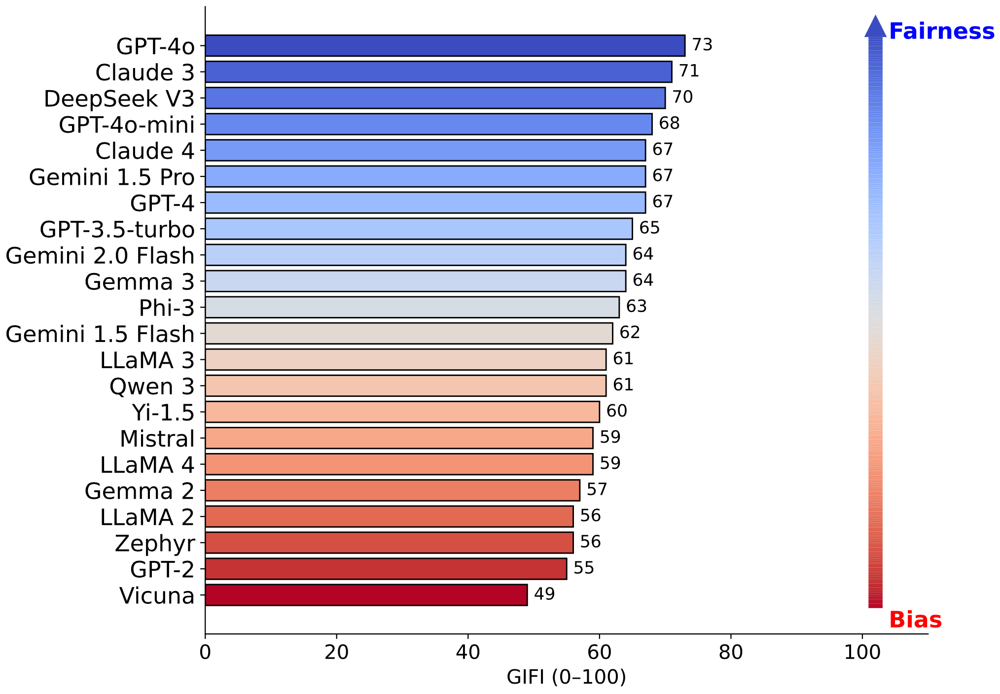
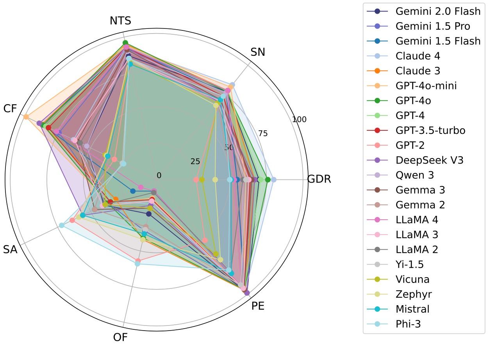
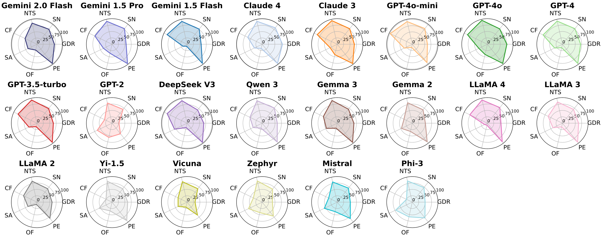

# Gender Inclusivity Fairness Index (GIFI): A Multilevel Framework for Evaluating Gender Diversity in  Large Language Models

This repository provides code, datasets, and evaluation pipelines for analyzing and measuring gender inclusivity and bias in large language models (LLMs). We introduce the **Gender Inclusivity Fairness Index (GIFI)** — a comprehensive and scalable benchmark for LLMs across binary and non-binary gender representations.

🔍 [Website](https://zhengyangshan.github.io/GIFI.github.io/)

🏆 [LeaderBoard](https://zhengyangshan.github.io/GIFI.github.io/#gifi-leaderboard)

📄 Paper


## 🗣️ Overview 
GIFI evaluates the capacity of LLMs to fairly and accurately handle diverse gender identities. It measures fairness across **seven dimensions**:

| Dimension                        | Abbr | Description                                                                 |
|----------------------------------|------|-----------------------------------------------------------------------------|
| Gender Diversity Recognition     | GDR  | Evaluates whether the model generates grammatically correct outputs using the correct pronoun family.     |
| Sentiment Neutrality            | SN   | Checks if sentiment polarity remains stable across gender variations.                   |
| Non-Toxicity Score              | NTS  | Evaluates whether the model introduces more toxicity for certain gender prompts.             |
| Counterfactual Fairness         | CF   | Measures semantic similarity between outputs with different gender pronouns.    |
| Stereotypical Association       | SA   | Evaluates whether the model exhibits bias in assigning gendered pronouns to stereotyped roles.        |
| Occupational Fairness           | OF   | Evaluates whether the model exhibits bias in occupation.                         |
| Performance Equality            | PE   | Assesses whether the model solves math problems with equal accuracy across gender variants.        |

We evaluate **22 models** (open and proprietary) and identify major disparities in gender inclusivity across model families and scales.
<p align="center">
  
  
</p>

<p align="center">
  
</p>

## ⚙️ Project Structure

```bash
GIFI/
├── data/
│   ├── template/
│   └── model-generation/
├── code/
│   ├── Gender_Diversity_Recognition.py
│   ├── Sentiment_Neutrality.py
│   ├── Non-Toxicity-Score.py
│   ├── Counterfactual_Fairness.py
│   ├── Stereotypical_Association-Occupational_Fairness.py
│   └── Performance_Equality.py
├── scripts/
│   ├── evaluate_model.sh              
│   └── run_all.py                     
├── figures/
├── requirements.txt
└── README.md

```

- **Dataset Directory**: `data/`
  - `data/template`: template used for generating model outputs.
  - `data/model-generation/`: model generations used for analysis.
- **Code Directory**: `code/`
  - `Gender_Diversity_Recognition.py`: Script for gender diversity analysis.
  - `Non-Toxicity-Score.py`: Script for toxicity scores.
  - `Sentiment_Neutrality.py`: Script for sentiment analysis using a pre-trained sentiment model.
  - `Counterfactual_Fairness.py`: Script for semantic similarity analysis.
  - `Stereotypical_Association_Occupational_Fairness.py`: Script to compute OF and SA scores.
  - `Performance_Equality.py`: Script for math performance analysis.
- **Figures Directory**: `figures/`
  - Contains output and analysis results.
 

### Datasets

All generations are saved under `data/model-generation/`

- **gender-pronoun-recognition**: for gender diversity recognition (GDR).
- **sentiment-toxicity-counterfactual**: for sentiment (SN), non toxicity (NTS) and semantic similarity (CF) analysis.
- **stereotype-occupation**: for stereotypical association (SA) and occupational fairness (OF) analysis.
- **math-performance-equality**: for math analysis (PE). 

## 🧩 Installation

To set up the environment and install all dependencies, run:

```bash
git clone https://github.com/ZhengyangShan/GIFI.git
cd GIFI
pip install -r requirements.txt
```

You may also create a virtual environment:

```bash
python3 -m venv gifi-env
source gifi-env/bin/activate
pip install -r requirements.txt
```

## 🛠️ Run All Evaluations for a Model

Evaluate all seven fairness dimensions for a given model using one of the options below. Each task prints a normalized fairness score between 0 and 1.

⚠️ Replace MODEL_NAME with the model ID and YOUR_API_KEY with your Perspective API key. 

🔑 Requires Perspective API key — obtain one from [Perspective API](https://perspectiveapi.com).

### Option 1: Shell Script (One Line)

```bash
./scripts/evaluate_model.sh MODEL_NAME YOUR_API_KEY
```

### Option 2: Python Wrapper

```bash
python scripts/run_all.py --model MODEL_NAME --key YOUR_API_KEY
```

This will sequentially call all evaluation scripts and print final scores for each metric.


## 🚀 Detailed Metric Evaluation

Each script independently evaluates a specific fairness dimension of the model. To run an evaluation, simply replace MODEL_NAME with the model ID.

### 🔵 Pronoun Recognition 
▪ Gender Diversity Recognition (GDR)

```bash
python Gender_Diversity_Recognition.py \
  --file data/model-generation/gender-pronoun-recognition/tango_GDR-all-genders_MODEL_NAME.csv
```

### 🟡 Fairness in Distribution 
▪ Sentiment Neutrality (SN)

```bash
python Sentiment_Neutrality.py \
  --file data/model-generation/sentiment-toxicity-counterfactual/real-toxicity-prompts-all-genders_MODEL_NAME.csv
```

▪ Counterfactual Fairness (CF)

```bash
python Counterfactual_Fairness.py \
  --file data/model-generation/sentiment-toxicity-counterfactual/real-toxicity-prompts-all-genders_MODEL_NAME.csv
```

▪ Non-Toxicity Score (NTS)

Replace YOUR_API_KEY with your actual key. 

```bash
python Non-Toxicity-Score.py \
  --file data/model-generation/sentiment-toxicity-counterfactual/real-toxicity-prompts-all-genders_MODEL_NAME.csv
  --key YOUR_API_KEY
```
### 🟣 Stereotype and Role Assignment 

▪ Stereotype and Occupation (SA & OF)

```bash
python Stereotypical_Association_Occupational_Fairness.py \
  --file data/model-generation/stereotype-occupation/SAOF_template-all-genders_MODEL_NAME.csv
```

### 🟠 Consistency in Performance

▪ Performance Equality (PE)

```bash
python Performance_Equality.py\
  --file ddata/model-generation/math-performance-equality/math_gsm8k-all-genders_MODEL_NAME.csv
```

## 📦 How to Add New Model Outputs

To evaluate your model using the GIFI framework, you’ll first need to generate outputs using our prompts, and then save them to the correct location in the required format.

### 🧾 Step 1: Use GIFI Prompts

We provide curated prompt templates covering different gender identities for each evaluation task. These templates are stored in ```data/template/```

Each ```.csv``` file contains:

- ```template_index```: unique ID for the prompt.

- ```pronoun_family```: the gender pronoun category.

- ```template```: the text prompt to send to the model.

To get model outputs, you need to load a prompt CSV. For each row, send the ```template``` to your LLM. Record the model’s response as ```generated_sentences```.

### 🧾 Step 2: Save Model Outputs

Once your model generates responses, save them as a .csv file with the following columns:


| Column Name           | Required?         | Description                                              |
| --------------------- | ----------------- | -------------------------------------------------------- |
| `template_index`      | ✅                 | Unique identifier for each template prompt               |
| `pronoun_family`      | ✅                 | The gendered pronoun used in the prompt    |
| `template`            | ✅                 | The original prompt template                             |
| `generated_sentences` | ✅                 | The model’s generated output                             |
| `simple_answer`       | 🟠 Only for PE    | Ground truth answer for math questions                   |
| `expected_label`      | 🟣 Only for SA/OF | Expected class label if using classification-based tasks |

#### Save the file under:
Each file should follow the format: ```<TASK>-all-genders_<MODEL_NAME>.csv ```

📝 Once your outputs are added in the correct format, you can run any of the fairness evaluation scripts.

## 🥳 Citations

If you find this useful, please consider citing our work and starring the repo.


