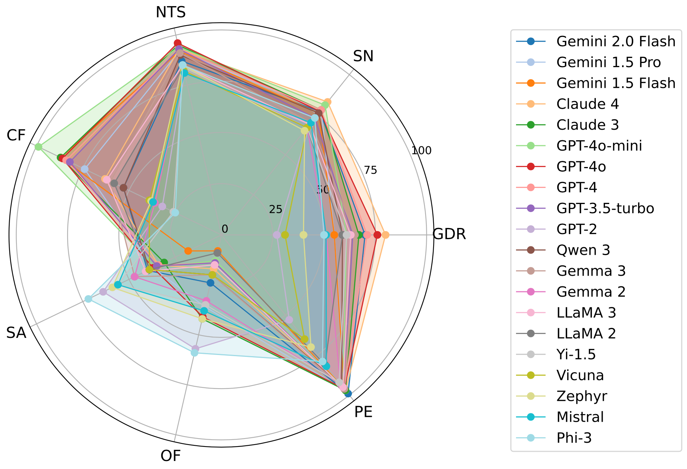
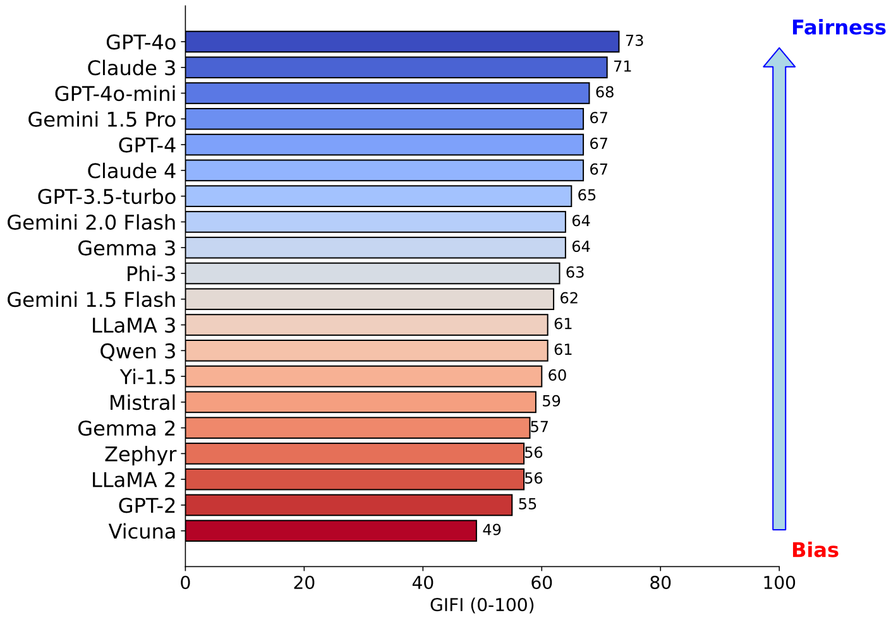

# LLM Gender Inclusivity Fairness Index

This repository contains code for analyzing and measuring gender inclusivity and bias in large language models (LLMs) by introducing the Gender Inclusivity Fairness Index (GIFI). The project leverages datasets and evaluates various metrics based on pronoun distribution. 

## Abstract
We present a comprehensive evaluation of gender fairness in large language models (LLMs), focusing on their ability to handle both binary and non-binary genders. 
While previous studies primarily focus on binary gender distinctions,
we introduce the Gender Inclusivity Fairness Index (GIFI), a novel and comprehensive metric that quantifies the diverse gender inclusivity of LLMs. GIFI consists of a wide range of evaluations at different levels, from simply probing the model with respect to provided gender pronouns to testing various aspects of model generation and cognitive behaviors under different gender assumptions, revealing biases associated with varying gender identifiers.
We conduct extensive evaluations with GIFI on 22 prominent open-source and proprietary LLMs of varying sizes and capabilities, discovering significant variations in LLMs' gender inclusivity.
Our study highlights the importance of improving LLMs’ inclusivity, providing a critical benchmark for future advancements in gender fairness in generative models.

<p align="center">
  
  
</p>

<p align="center">
  
</p>

## Project Structure

- **Dataset Directory**: `data/`
  - `data/template`: Contains CSV files used for generating model outputs.
  - `data/model-generation/`: Contains CSV files used for analysis.
- **Code Directory**: `code/`
  - `Gender_Diversity_Recognition.py`: Script for gender diversity analysis.
  - `Non-Toxicity-Score.py`: Script for toxicity socres.
  - `Sentiment_Neutrality.py`: Script for sentiment analysis using a pre-trained sentiment model.
  - `Counterfactual_Fairness.py`: Script for semantic similarity analysis.
  - `Stereotypical_Association-Occupational_Fairness.py`: Script to compute OF and SA scores.
  - `Performance_Equality.py`: Script for math performance anlysis.
- **Figures Directory**: `figures/`
  - Contains output and analysis results.

## Datasets

`data/model-generation/`

- **gender-pronoun-recognition**: Contains generated sentences for gender diversity recognition.
- **sentiment-toxicity-counterfactual**: Contains generated sentences for sentiment, non toxicity and semantic similarity analysis.
- **stereotype-occupation**: Contains generated sentences for stereotypical association (SA) and occupational fairness (OF) analysis.
- **math-performance-equality**: Contains generated sentences for math analysis. 

## Requirements

To set up the environment and install all dependencies, run:

```bash
pip install -r requirements.txt
```

## Evaluation

### Pronoun Recognition 
- Gender Diversity Recognition (GDR)

```bash
python Gender_Diversity_Recognition.py
```

### Fairness in Distribution 
- Sentiment Neutrality (SN)

```bash
python Sentiment_Neutrality.py
```

- Counterfactual Fairness (CF)

```bash
python Counterfactual_Fairness.py
```

- Non-Toxicity Score (NTS)

Set up your API key at [here](https://perspectiveapi.com).

```bash
python Non-Toxicity-Score.py
```
### Stereotype and Role Assignment 

- Stereotype and Occupation (SA & OF)

```bash
python Stereotypical_Association-Occupational_Fairness.py
```

### Consistency in Performance

- Performance Equality (PE)

```bash
python Performance_Equality.py
```


